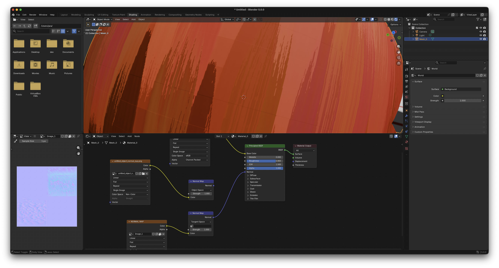
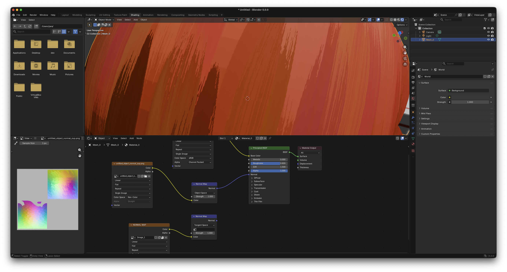

# Extract — Object-Space Normal Output

The **Extract** track emits an **object-space** normal map, while the
regular Export pipeline emits a tangent-space map. Notes on when to
use which.

## Default: tangent-space

Use tangent-space (Export) for general work, and especially when the
mesh deforms — skinning, blendshapes, cloth, soft body. An
object-space normal is locked to the rest pose and goes wrong the
moment the surface moves. A few engines re-transform object-space
normals through a skin, but it is not a default path — don't rely on
it.

## When object-space is worth it

On static, hard-surface assets, object-space holds up better across
sharp folds and strongly curved regions. The painter computes its
normal perturbation in object space; Export projects that into tangent
space, and the consumer (DCC or engine) then reconstructs world-space
normals by recombining with its own tangent basis. When the consumer's
tangent generator disagrees with the bake — common across DCCs and
engines — that round-trip blurs detail across creases and
high-curvature regions. Extract skips both steps: the consumer applies
the model matrix and reads the result without rebuilding a tangent
basis.

| Tangent-space (Export) | Object-space (Extract) |
|---|---|
|  |  |

## Output options

**Up axis.** Internal frame is +Y up. Pick the convention your target
expects:

- **Y-up** — Maya, Unity, glTF, OpenGL.
- **Z-up** — Blender, Unreal Engine, 3ds Max.

Z-up applies a +90° rotation about X (`(x, y, z) → (x, -z, y)`).

**Encoding.**

- **PNG 8-bit** — 256 levels per channel. Smallest file, but
  quantization can show as banding on smooth surfaces.
- **PNG 16-bit** — 65,536 levels per channel. Recommended default.
- **EXR** — 32-bit float, linear. Use when you want the raw vector
  without `[0, 1]` quantization.

## Caveat: Extract bypasses base-normal blending

The Export pipeline UDN-blends the painted normal with any per-layer
base normal map you supplied. Extract does not — its output is the
painted normal alone. If your asset relies on a baked base/detail
normal, go through Export, or composite the two maps in the DCC
yourself.
